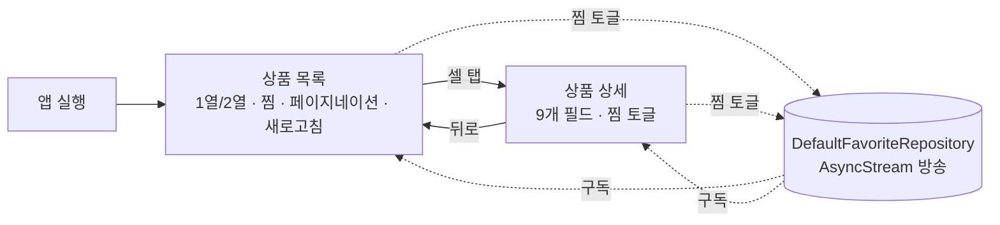

# JGNR-HW — PRD (Product Requirements Document)

> `/setup-ios`(빈/신규 레포 초기 구축)가 2026-09-12에 생성한 제품 요구사항 문서입니다.
> 저장 위치: `.claude/ios-agent-system/PRD.md`
>
> **이 문서는 모든 리뷰의 대조 기준입니다.** `/review-ios`와 `ios-review` 에이전트는
> 여기 적힌 기술 스택·요구사항과 실제 구현이 일치하는지 검증하며, 불일치는 지적 대상입니다.
> 스택 결정이 바뀌면 §3을 갱신하고 `/setup-ios update`를 실행하세요.
> §2 기능 요구사항과 §6 마일스톤은 셋업 이후에도 자란다 — `/task-ios`가 비단순 작업의 AUDIT를 만들 때마다
> F 행(출처 `← intents/…`)과 M 행(연결 AUDIT)을 append한다. 손으로 고쳐도 되지만 출처 링크는 남긴다.

## 1. 제품 개요

- **한 줄 정의**: DummyJSON Products API의 상품을 1열/2열로 훑어보고, 상세를 확인하고, 찜을 로컬에 저장하는 iOS 앱 (채용 사전 과제)
- **목표 / 해결하는 문제**: 요구사항 해석과 구조 설계 능력을 코드로 보여준다 — 원격 데이터(상품)와 로컬 데이터(찜·보기 모드)의 책임 분리, 상태 관리 구조, 비동기 처리, 화면 간 상태 동기화가 코드 리딩만으로 읽혀야 한다. 1일 안에 요구사항을 빠짐없이 구현한다
- **비목표 (Non-Goals)**: 검색·정렬·필터·카테고리, 서버 찜 API, 로그인·장바구니·결제, 상품 목록 오프라인 캐시, UI 폴리싱(애니메이션·커스텀 디자인 시스템), UI 테스트(XCUITest), CI/CD, 외부 라이브러리 도입

## 2. 요구사항

### 기능 요구사항

| # | 요구사항 | 수용 기준 (Acceptance) | 우선순위 |
|---|----------|------------------------|----------|
| F1 | 상품 목록 | 실행 시 `GET /products?limit=20&skip=0&select=id,title,price,thumbnail` 호출, 셀마다 상품명·가격(`$` USD)·이미지·찜 여부 표시 ← intents/20260912-initial-requirements.md #1 | Must |
| F2 | 페이지네이션 | 20개씩. 마지막 로드 페이지의 16번째 아이템 `onAppear` 시 `skip += 20` 요청. 반복 노출·스크롤 반복에도 같은 페이지 요청 1회(진행 중 Task 가드). `total` 도달 후 요청 0건 ← #2 | Must |
| F3 | 풀투리프레시 | 당겨서 새로고침 → `skip=0`부터 재로드해 목록 교체. 진행 중 다음 페이지 Task 취소, 늦은 응답 무시. 찜 상태 유지 ← #3 | Must |
| F4 | 보기 방식 전환 | 툴바 토글로 1열(리스트)/2열(그리드). 전환해도 표시 정보 4가지·로드된 페이지 동일(같은 `items`, 컨테이너만 교체). 선택은 UserDefaults에 영속되어 재실행 후 유지 ← #4 | Must |
| F5 | 찜 토글 | 목록 셀·상세 양쪽에서 찜/해제. 서버 미사용, UserDefaults에 찜 ID 집합 저장. 종료 후 재실행해도 유지 ← #5 | Must |
| F6 | 찜 동기화 | 상세에서 토글 후 목록 복귀 시 즉시 반영(역방향 동일). 단일 소스 `DefaultFavoriteRepository`의 `AsyncStream` 방송으로 구현 ← #6 | Must |
| F7 | 상품 상세 | 셀 탭 → push, 진입 시 `GET /products/{id}`. 이미지·상품명·가격·할인율·브랜드·카테고리·평점·재고·설명 표시 + 찜 토글 ← #7 | Must |
| F8 | 에러 처리 | 첫 페이지/상세 실패 → 한국어 문구 + "다시 시도". 다음 페이지 실패 → 목록 유지 + 푸터 인라인 재시도 ← #8 | Must |
| F9 | 빌드 조건 | clone → Xcode 26.5로 `JGNR-HW.xcodeproj` 열기 → 추가 작업 없이 시뮬레이터 빌드·실행. 외부 의존성 0 ← #9 | Must |
| F10 | 유닛 테스트 | ViewModel(페이지네이션 1회 요청·새로고침 취소·찜 관찰·보기 모드 영속), `DefaultFavoriteRepository`(토글·영속·방송), DTO→Entity 매핑을 Swift Testing으로 검증 ← #10 | Must |

#### 범위 밖 (intent "범위 밖"에서 이동)

검색·정렬·필터·카테고리 / 서버 찜 API·로그인·장바구니·결제 / 상품 목록 오프라인 캐시 / UI 폴리싱·다크모드 전용 디자인 / UI 테스트·CI/CD

### 비기능 요구사항

| # | 항목 | 기준 |
|---|------|------|
| N1 | 언어·툴체인 | Xcode 26.5 · Swift 6 language mode · strict concurrency complete · `SWIFT_DEFAULT_ACTOR_ISOLATION = nonisolated`(격리 명시) |
| N2 | 플랫폼 | iOS 17.0+ · SwiftUI 전용 · iOS 17 안정 API만 (iOS 26 전용 API 금지) |
| N3 | 의존성 | 외부 라이브러리 0 — URLSession · UserDefaults · 자체 이미지 캐시 |
| N4 | 책임 분리 | 원격(`ProductRepository`)과 로컬(`FavoriteRepository`)이 별도 protocol·구현. DTO는 Data 밖으로 나가지 않음 |
| N5 | 동시성 | 데이터 레이스 0 (컴파일러 강제). 공유 상태는 `@MainActor` 클래스 또는 `actor`. `@unchecked Sendable` 금지 |
| N6 | 성능 | 목록 스크롤 중 메인 스레드 이미지 디코딩 없음. 같은 URL 동시 요청 병합. NSCache 상한 설정 |
| N7 | 접근성·UX | 시스템 텍스트 스타일(Dynamic Type)·시맨틱 컬러. 찜 버튼 접근성 라벨. UX 문구 한국어 |
| N8 | 제출 | fork 레포 `feature/jgnr-hw` → upstream `main` PR. PR 본문: 설계 설명·기술 판단·개선점·AI 활용 내역. 수행 시간 1일 |

## 3. 기술 스택 확정표 (Locked Decisions)

> `/setup-ios` 인터뷰(2026-09-12)에서 사용자가 확정한 의사결정. **구현은 이 표를 벗어나지 않는다.**

| 항목 | 결정 | 근거 |
|------|------|------|
| 모듈화 방식 | 단일 xcodeproj (`JGNR-HW.xcodeproj`, 레포 루트, Xcode 16+ 파일 시스템 동기화 그룹) | clone 후 추가 작업 없이 빌드(F9). 1일 과제 규모. 생성 도구 흔적 없음 |
| 모듈 구조 | 디렉토리 레이어 `App / Presentation / Domain / Data / Shared(Network·Image·LocalStorage)` | 원격·로컬 책임 구분이 폴더 구조에서 드러남. Core 대신 Shared 명명(사용자 지정) |
| 디자인 패턴 | MVVM-C — `@MainActor @Observable` ViewModel + NavigationStack path 소유 `AppCoordinator` | 화면 조립·이동 책임을 Coordinator로 모아 ViewModel을 순수하게. ViewModel은 클로저로 이동 요청 |
| 아키텍처 추상화 | 풀 Clean — Domain에 Entity·Repository protocol·UseCase(struct) | 심사 포인트인 "계층별 책임"을 명시. UseCase는 concrete struct(protocol 없음) |
| 비동기 처리 | Swift Concurrency 전용 (async/await · actor · AsyncStream · Task) | Swift 6 strict와 정합. Combine·GCD·완료 핸들러 금지 |
| UI 프레임워크 | SwiftUI 전용 | 과제 조건 |
| DI 방식 | 수동 이니셜라이저 주입 — 조립 지점 `App/AppDependencies`(인프라→Repository→UseCase) + `App/AppCoordinator`(ViewModel) | 외부 의존 없음, 설명 쉬움, 테스트 더블 교체 용이. 싱글턴 금지. ImageProvider만 SwiftUI Environment로 전달(인스턴스는 AppDependencies가 1개 생성) |
| 네트워크 레이어 | URLSession 직접 — `HTTPClient` protocol + `URLSessionHTTPClient` + `Endpoint` + Codable DTO + `NetworkError` | API 2개 규모. 외부 의존 0 |
| 로컬 저장 | UserDefaults — `KeyValueStore` protocol + `UserDefaultsKeyValueStore`. 찜 ID 집합(`Set<Int>`) + 보기 모드 | 요구(종료 후 유지)를 최소 코드로. protocol 뒤라 교체 가능 |
| 이미지 로딩 | 자체 구현 — `@MainActor ImageProvider`(NSCache 메모리 캐시) + `actor ImageLoader`(디스크 캐시 + in-flight 병합) + `RemoteImage` 뷰 | 외부 의존 0, `AsyncImage`는 캐시 없음. 메모리 캐시를 MainActor에 두어야 뷰가 캐시 히트를 동기로 읽어 첫 프레임부터 그린다(깜빡임 제거) |
| 최소 지원 OS / Swift | iOS 17.0+ / Swift 6 strict / 기본 격리 `nonisolated` | `@Observable` 사용 가능 최소선. 격리를 명시해 경계가 코드에 드러남 |
| 외부 의존성 | 없음 | F9·PR 설명 부담 없음 |
| 린트 | 없음 (SwiftLint 미사용) | 사용자 결정. 컨벤션은 `check-architecture.sh` + 리뷰 게이트 |
| CI/CD | 없음 | 사용자 결정. 로컬 하네스 + pre-commit 훅 |
| Release/Debug 타겟 분리 | 기본 Debug·Release만 | 환경별 서버 없음 |
| 유닛 테스트 | 핵심 도메인·뷰모델 필수 — Swift Testing, 수용 기준당 1개 | 밀도 "테스트 간결" |
| UI 테스트 | 작성 안 함 | 1일 제한. 시뮬레이터 확인은 `/verify-ios` |
| 산출물 밀도 | 추상화 표준 · 테스트 간결 · 주석 간결 · 모듈 표준 | protocol은 테스트 더블이 있는 경계만(ProductRepository·FavoriteRepository·HTTPClient·KeyValueStore + 보기 모드 저장 경계는 Commit 6 결정) |
| 앱 식별 | 타겟 `JGNR-HW` · 모듈 `JGNR_HW` · 번들 `com.appboong.jgnr-hw` · 테스트 `JGNR-HWTests` | 사용자 지정 |
| UX 언어 | 한국어 (API 데이터는 원문) | 사용자 결정 |

## 4. 화면 / 사용자 플로우



| 화면 | 역할 | 진입 경로 |
|------|------|-----------|
| 상품 목록 (`ProductListView`) | 첫 화면. 페이지네이션·풀투리프레시·1열/2열 토글·셀 찜 버튼·셀 탭 → 상세 | 앱 실행 즉시 (로그인·온보딩 없음) |
| 상품 상세 (`ProductDetailView`) | `GET /products/{id}` 결과 9개 필드 + 찜 토글. 로딩·에러·재시도 | 목록 셀 탭 → `Route.productDetail(id:)` push |

## 5. 아키텍처 개요

```
App (JGNRHWApp · AppDependencies · AppCoordinator · Route)
 └─ Presentation (ProductList · ProductDetail · Common)  ── UseCase만 호출
      └─ Domain (Entities · Repositories(protocol) · UseCases(struct))  ── Foundation만
            ▲
      Data (Remote: Endpoint·DTO / Local: FavoriteLocalDataSource / Repositories: Default*)
       └─ Shared (Network: HTTPClient / LocalStorage: KeyValueStore / Image: ImageProvider·ImageLoader·RemoteImage)
```

- 핵심 데이터 흐름: View `.task` → ViewModel → UseCase → Repository(원격 `DefaultProductRepository` = HTTPClient+DTO 매핑 / 로컬 `DefaultFavoriteRepository` = KeyValueStore + `Set<Int>` 진실 + AsyncStream 방송) → ViewModel 상태 갱신 → View 재렌더
- 페이지네이션 3중 가드(진행 중 Task · `hasMore` · 임계 인덱스), 새로고침은 진행 중 페이지 Task 취소 + 늦은 응답 무시
- 상세 설계·타입 시그니처·커밋 계획은 `audits/20260912-initial-setup.md`

## 6. 마일스톤

| 단계 | 내용 | 연결 AUDIT |
|------|------|------------|
| M1 | 초기 구축 — scaffold → Shared 인프라 → Domain → Data → Image → ProductList → ProductDetail → App 조립 (8 커밋) | `audits/20260912-initial-setup.md` |

## 7. 리스크 / 알려진 한계

- Xcode 26 파일 시스템 동기화 그룹 프로젝트를 도구로 생성하기 어려움 → Commit 1은 Xcode GUI 생성(안 A) 권장, 직후 빌드로 검증
- Swift 6 strict + 기본 격리 `nonisolated` 조합에서 Sendable·격리 컴파일 에러 다발 예상 → Domain/DTO에 `Sendable` 조기 부여, 커밋마다 빌드
- 페이지네이션 임계 인덱스 off-by-one → Commit 6 테스트가 "16번째에서 정확히 1회"를 검증
- 보기 모드 저장 경계(ViewModel이 인프라를 직접 볼 수 없음) → Commit 6 착수 게이트에서 Repository+UseCase 안 vs 예외 허용 안 결정
- 이미지 디스크 캐시에 용량 상한·정리가 없다 — `URL.cachesDirectory`라 OS가 압박 시 회수하는 것에 의존한다
- 진단 로그 인프라가 없다 — `NetworkError.transport`·`.decoding`이 원인 문자열을 담지만 읽는 곳이 없어 실패 원인이 소멸한다
- 찜 JSON 디코딩이 실패하면 "저장값 없음"과 구분되지 않아, 다음 토글이 원본을 빈 집합으로 덮어쓴다 (저장 스키마를 바꿀 때 마이그레이션 필요)
- 의도적으로 미룬 것: 목록 오프라인 캐시, 검색, UI 테스트
